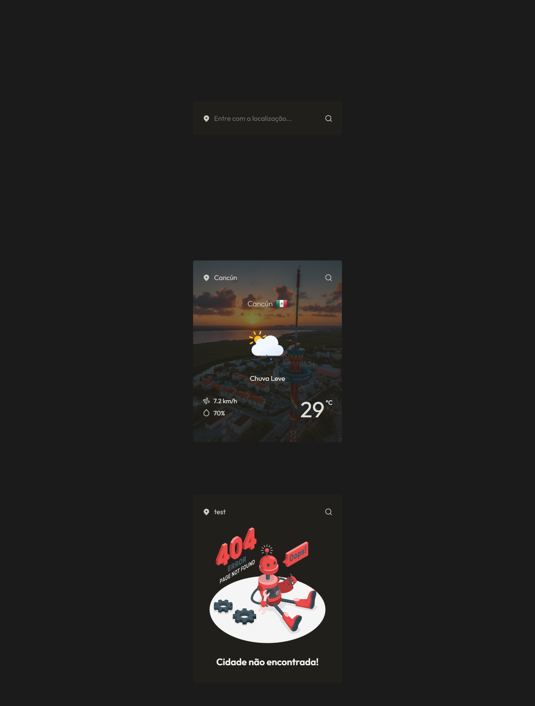

<a name="readme-top"></a>

<div align="center">

[![MIT License][license-shield]][license-url]
[![Version][version-shield]][version-shield]

</div>

<br />
<div align="center">
    <a href="https://github.com/joaosouza7/weather-app">
    
    </a>
    <br />
    <br />

  <h3 align="center">Weather App</h3>

  <p align="center">
    Consulte as condições meteorológicas de um lugar específico.
    <br />
    <a href="https://weather-app-joaosouza7.vercel.app/"><strong>Explore o projeto »</strong></a>
    <br />
    <br />
    <a href="#sobre">Sobre</a> •
    <a href="#features">Features</a> • 
    <a href="#tecnologias">Tecnologias</a> • 
    <a href="#preview">Preview</a> • 
    <a href="#como-executar">Como executar?</a> • 
    <a href="#licenca">Licença</a> •
    <a href="#contato">Contato</a>
  </p>
</div>

<!--Sobre o Projeto-->
<h2 id="sobre">💻 Sobre o projeto</h2>

🌥️ Weather App - é um aplicativo React que permite ao usuário consultar as condições meteorólogicas de um lugar específico, e também exibir uma imagem aleatória de acordo com a localização buscada. Para obter essas informações, foram utilizadas três APIs externas: [OpenWeatherMap][openWeather-url], [Unsplash][unsplash-url] e [CountryFlag][countryFlags-url].

<!--Features-->
<h2 id="features">✅ Features</h2>

Ao entrar no aplicativo é possível ver um campo de pesquisa, onde o usuário deve digitar o nome da localização desejada. Em seguida, o aplicativo buscará as informações meteorólogicas, bem como a imagem do local e irá exibi-las ao usuário. 

Caso não seja encontrada uma imagem para o local buscado, uma imagem padrão será exibida. Além disso, se o local buscado não existir, o sistema apresentará ao usuário uma mensagem de erro.

As seguintes informações são exibidas:

- [x] Nome da cidade
- [x] País
- [x] Imagem e descrição do tempo
- [x] Temperatura (ºC)
- [x] Velocidade do vento (km/h)
- [x] Umidade relativa do ar (%)

<!--Tecnologias-->
<h2 id="tecnologias">🛠 Tecnologias utilizadas</h2>

As seguintes ferramentas foram utilizadas no desenvolvimento do projeto.

* [React][react-url]
* [React Icons][reacticons-url]
* [Axios][axios-url]
* [Typescript][typescript-url]
* [Storyset Web Illustrations][storyset-url]

<!--Preview do projeto-->
<h2 id="preview">🔎 Preview do projeto</h2>

<div align="center">
  
</div>

<!--Como executar-->
<h2 id="como-executar">🚀 Como executar o projeto?</h2>

### Pré-requisitos

Antes de começar, você vai precisar ter instalado em sua máquina as seguintes ferramentas:
[Git][git-url], [Node][node-url]. 
Além disso, é bom ter um editor para trabalhar com o código como o [VSCode][vscode-url].

### 🎲 Rodando a aplicação

```bash
# Clone este repositório
$ git clone https://github.com/joaosouza7/weather-app

# Acesse a pasta do projeto no terminal/cmd
$ cd weather-app

# Instale as dependências do projeto
$ yarn | npm install

# Inicialize a aplicação
$ yarn dev | npm run dev
```

> ⚠️ Crie um arquivo `.env` na raiz do seu projeto e adicione suas **Keys** da API do OpenWeather e do Unsplash:

```.env
# Se criou o projeto com create-react-app
REACT_APP_NOME_DA_VARIAVEL=key-OpenWeatherMap
REACT_APP_NOME_DA_VARIAVEL=key-Unsplash

# Se criou o projeto com vite
VITE_NOME_DA_VARIAVEL=key-OpenWeatherMap
VITE_NOME_DA_VARIAVEL=key-Unsplash
```

<!--Licença-->
<h2 id="licenca">📝 Licença</h2>

Esse projeto está sob a licença [MIT][license-url]. Veja o arquivo `LICENSE` para mais detalhes.

<!--Contato-->
<h2 id="contato">✉️ Contato</h2> 

João Souza - [Linkedin](https://www.linkedin.com/in/joaosouzadesenvolvedorweb) - joaoosouza07@gmail.com

Portfólio - https://portfolio-joaosouza7.vercel.app/

<p align="right">(<a href="#readme-top">🔝 Voltar ao topo</a> )</p>

<!-- LINKS E IMAGENS -->

[license-shield]: https://img.shields.io/badge/LICENSE-MIT-green?style=for-the-badge
[license-url]: ./LICENSE

[version-shield]: https://img.shields.io/badge/VERSION-1.0.0-dc3545?style=for-the-badge

[openWeather-url]: https://openweathermap.org/api
[unsplash-url]: https://unsplash.com/developers
[countryFlags-url]: https://www.countryflagicons.com/

[git-url]: https://git-scm.com
[node-url]: https://nodejs.org/en
[vscode-url]: https://code.visualstudio.com/

[react-url]: https://react.dev/
[typescript-url]: https://www.typescriptlang.org/
[storyset-url]: https://storyset.com/web
[reacticons-url]: https://react-icons.github.io/react-icons/
[axios-url]: https://axios-http.com/ptbr/docs/intro